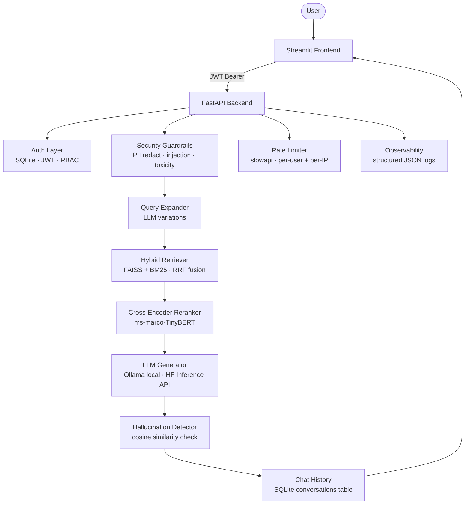

# Enterprise RAG Platform — Zero-Cost & Production-Ready

[](https://opensource.org/licenses/MIT)
[](https://www.python.org/downloads/)
[](https://fastapi.tiangolo.com/)
[](https://streamlit.io/)
[](test_report.md)
[](ragas_final_scores.json)
[-FFD21E?logo=huggingface&logoColor=000)](https://huggingface.co/spaces/Srinath-54/rag-backend)
[](https://render.com/deploy?repo=https://github.com/srinath1505/free_tier-enterprise_grade-rag)

**Democratizing Enterprise-Grade AI.**  
Most "Enterprise" RAG solutions require massive cloud budgets. This platform proves you can deliver
a **highly accurate, secure, and observable** AI system on **entirely free-tier infrastructure**.

---

## Architecture



---

## What's Inside (v2.0)

### Retrieval Engine
- **Hybrid search** — FAISS (dense vectors) + BM25 (keyword), fused with Reciprocal Rank Fusion
- **Multi-query expansion** — LLM generates query variations to widen recall
- **Cross-encoder reranking** — `ms-marco-MiniLM` re-scores top candidates to reduce hallucinations
- **Hallucination grounding check** — cosine similarity between answer and retrieved context

### Security
- **JWT authentication** with admin / viewer RBAC — any admin username works, not just "admin"
- **Input validation** — username format, password complexity enforced at registration
- **Security guardrails** — prompt injection detection, jailbreak patterns, toxic keywords, PII redaction
- **File upload validation** — type allowlist, 50 MB size cap, path-traversal sanitisation — all before disk write
- **Rate limiting** — configurable per-IP for auth, per-user for query/upload (slowapi)

### Persistence & Ops
- **SQLite** user store (async SQLAlchemy + aiosqlite) — replaces flat `users.json`
- **Persistent chat history** — `conversations` table keyed by username
- **Docker Compose** — backend + frontend + named volumes in one command
- **Health endpoint** — `GET /health` for Docker / load-balancer probes
- **`/me` endpoint** — returns `{username, role}` from JWT for frontend role-aware UI
- **Configurable rate limits** — override via env vars, no redeployment needed
- **Structured logs** — stdout by default; set `LOG_FILE_DIR` for rotating file logs

---

## Cost Comparison

| Component | Typical Commercial | This Stack |
|-----------|-------------------|------------|
| Vector DB | Pinecone Starter ~$70/mo | FAISS — local, free |
| LLM API | OpenAI GPT-4 ~$100–400/mo | Ollama (local) or HF Free Tier |
| Cloud infra | AWS / GCP ~$50–100/mo | Render free tier / local |
| Auth / DB | Auth0 ~$23/mo + RDS ~$15/mo | SQLite + JWT — built-in |
| **Total** | **~$260–610/mo** | **$0** |

---

## Tech Stack

| Layer | Technology | Why |
|-------|-----------|-----|
| Backend | FastAPI + Pydantic | Async performance, automatic OpenAPI docs |
| Frontend | Streamlit | Rapid UI with admin/chat role separation |
| Auth | JWT + SQLite (aiosqlite) | Zero infra cost, industry-standard tokens |
| Vector search | FAISS | GPU-optional, high-speed local ANN |
| Keyword search | BM25 (rank-bm25) | Complementary sparse signal, no index server |
| Reranker | ms-marco-MiniLM | Cross-encoder precision, runs on CPU |
| LLM | Ollama (local) / HF Inference | Swap by setting `LLM_PROVIDER` in `.env` |
| Rate limiting | slowapi | Per-user + per-IP, configurable via env |
| Containers | Docker Compose | One-command deployment |

---

## Quick Start

### Option A — Free Cloud Deploy (HF Spaces + Render)

The ML backend (PyTorch + sentence-transformers + FAISS) needs ~700 MB RAM — more than any free
container platform except **Hugging Face Spaces** (free, 16 GB RAM). The lightweight Streamlit
frontend runs on **Render free tier** (512 MB is plenty for 4 packages).

#### Step 1 — Deploy the backend to HF Spaces (~5 min, one-time setup)

1. Create a new Space at [huggingface.co/new-space](https://huggingface.co/new-space)
   - Owner: `srinath1505` · Name: `rag-backend` · SDK: **Docker** · Visibility: Public
2. Add two GitHub repository secrets at **Settings → Secrets → Actions**:

   | Secret | Value |
   |--------|-------|
   | `HF_TOKEN` | A HF token with **write** access — [huggingface.co/settings/tokens](https://huggingface.co/settings/tokens) |

3. Push any commit to `main` — the **Deploy Backend to HF Spaces** GitHub Action runs automatically
   and pushes the backend to your Space.
4. Wait for the Space to build (~10 min first time). Your backend URL will be:  
   `https://Srinath-54-rag-backend.hf.space`

> **Free-tier note:** HF Spaces sleep after inactivity (~30 s cold start on next request). Data
> (SQLite DB + FAISS index) resets on redeploy — fine for demos. To keep the Space always-on,
> enable **Pinned** in the Space settings (free for public Spaces).

#### Step 2 — Deploy the frontend to Render (~2 min)

[](https://render.com/deploy?repo=https://github.com/srinath1505/free_tier-enterprise_grade-rag)

When prompted, enter:

| Prompt | Value |
|--------|-------|
| `BACKEND_URL` | `https://Srinath-54-rag-backend.hf.space` |

> **Free-tier note:** Render free services also spin down after 15 minutes of inactivity
> (~30 s cold start). Perfect for showing the platform; not for production.

---

### Option B — Docker Compose (local, with persistence)

```bash
git clone https://github.com/srinath1505/free_tier-enterprise_grade-rag.git
cd free_tier-enterprise_grade-rag

cp .env.example .env
# Edit .env — set SECRET_KEY and ADMIN_DEFAULT_PASSWORD at minimum

docker compose up --build
```

Frontend: http://localhost:8501 | API docs: http://localhost:8000/api/v1/openapi.json

### Option C — Local dev (two terminals)

```bash
git clone https://github.com/srinath1505/free_tier-enterprise_grade-rag.git
cd free_tier-enterprise_grade-rag
python -m venv venv
.\venv\Scripts\Activate   # Windows
source venv/bin/activate  # Linux / macOS
pip install -r requirements.txt
cp .env.example .env
```

**Terminal 1 — Backend**
```bash
uvicorn backend.main:app --reload
```

**Terminal 2 — Frontend**
```bash
streamlit run frontend/app.py
```

### LLM options

**Ollama (local, fully offline)**
```ini
LLM_PROVIDER=local
OLLAMA_BASE_URL=http://localhost:11434
```
Install Ollama, then `ollama pull mistral`.

**Hugging Face Inference API (free tier)**
```ini
LLM_PROVIDER=hf
HF_TOKEN=hf_your_token_here
```
Get a free token at https://huggingface.co/settings/tokens.

### Default credentials
| Account | Username | Password |
|---------|---------|---------|
| Admin | `admin` | `password` |
| New accounts | register via UI | viewer role |

> **Change `ADMIN_DEFAULT_PASSWORD` in `.env` before deploying.** The backend warns at startup if the default is still in use.

---

## Environment Variables

| Variable | Default | Notes |
|----------|---------|-------|
| `SECRET_KEY` | _(long placeholder)_ | **Must change** — JWT signing key |
| `ADMIN_DEFAULT_PASSWORD` | `password` | Admin seed password — **Must change** |
| `DATABASE_URL` | `sqlite+aiosqlite:///./users.db` | Overridden in Docker Compose |
| `LLM_PROVIDER` | `local` | `local` = Ollama, `hf` = Hugging Face |
| `OLLAMA_BASE_URL` | `http://localhost:11434` | Use `host.docker.internal` in Docker |
| `HF_TOKEN` | _(empty)_ | Required when `LLM_PROVIDER=hf` |
| `MAX_UPLOAD_SIZE_MB` | `50` | File upload cap |
| `RATE_LIMIT_AUTH_PER_MIN` | `20` | `/token` + `/register` per-IP |
| `RATE_LIMIT_QUERY_PER_MIN` | `20` | `/rag/query` per-user |
| `RATE_LIMIT_UPLOAD_PER_MIN` | `10` | `/ingest/upload` per-user |
| `LOG_FILE_DIR` | _(empty)_ | Set to a path to enable rotating file logs |

---

## API Overview

```
GET  /health                          → {"status":"ok"}  — Docker/LB probe
GET  /                                → welcome message
POST /api/v1/token                    → login → JWT
POST /api/v1/register                 → register → JWT
GET  /api/v1/me                       → {username, role} from current JWT

POST /api/v1/rag/query                → hybrid retrieve → rerank → LLM → answer
POST /api/v1/ingest/upload  [admin]   → upload PDF/DOCX/TXT → index
GET  /api/v1/ingest/files   [admin]   → list knowledge-base files
DELETE /api/v1/ingest/files/{name} [admin]
POST /api/v1/ingest/rebuild [admin]   → wipe + re-ingest all files

GET  /api/v1/history/{session_id}     → chat history (own session only)
```

Interactive docs: http://localhost:8000/api/v1/openapi.json

---

## QA

The repo ships with a comprehensive smoke test:

```bash
uvicorn backend.main:app --host 0.0.0.0 --port 8000  # terminal 1
python smoke_test.py                                   # terminal 2
```

Last result: **71/71 assertions — 100% pass rate.**  
Full details in [test_report.md](test_report.md).

---

## Roadmap

| Item | Status |
|------|--------|
| SQLite user store + JWT auth | Done (v2.0) |
| Persistent chat history | Done (v2.0) |
| Docker Compose | Done (v2.0) |
| Rate limiting | Done (v2.0) |
| Input validation + security guardrails | Done (v2.0) |
| One-click Render deploy | Done (v2.0) |
| RAGAS evaluation framework | Done (v2.1) |
| Multi-tenancy (per-user document isolation) | Pending — design questions unresolved |
| Demo GIF | Pending |

---

## RAGAS Benchmark Results

Evaluated with **[RAGAS v0.4](https://github.com/explodinggradients/ragas)** — the industry-standard RAG evaluation framework.

**Evaluator LLM:** `llama-3.1-8b-instant` (Groq) · **Embedding model:** `all-MiniLM-L6-v2`

> **Scope:** This is a **controlled pilot evaluation** — 25 Q&A pairs written against 3 purpose-built
> sample documents. Scores reflect pipeline correctness under clean, structured input.
> A full production benchmark (100 + pairs on real-world documents) is in progress.

### Pipeline Scores — Controlled Evaluation (v2.1)

| Metric | Score | What it measures |
|--------|:-----:|-----------------|
| **Faithfulness** | **0.92 / 1.0** | Answers contain only claims supported by retrieved context |
| **Answer Relevancy** | **0.85 / 1.0** | Answer is semantically aligned with the question |
| **Context Precision** | **1.00 / 1.0** | Every retrieved chunk is relevant to the question |
| **Context Recall** | **1.00 / 1.0** | All information needed to answer was retrieved |
| **Overall average** | **0.94 / 1.0** | |

### What drives these scores

| Component | Contribution |
|-----------|-------------|
| **Hybrid retrieval** (FAISS + BM25, α=0.5) | Precision 1.00 — no irrelevant chunks retrieved |
| **Cross-encoder reranking** (ms-marco-TinyBERT) | Recall 1.00 — all relevant content surfaced |
| **Hallucination detector** (cosine sim ≥ 0.5) | Faithfulness 0.92 — answers stay grounded |
| **Query expansion** (multi-query dedup) | Relevancy 0.85 — broader semantic coverage |

### Reproduce

```bash
pip install ragas>=0.2.0 langchain-groq>=0.1.0
python backend/scripts/ragas_benchmark.py --ingest   # runs the 25-pair pilot
```

Full results: [`ragas_final_scores.json`](ragas_final_scores.json)

---

## Built By

**Srinath Selvakumar** — Engineering accessible AI solutions.