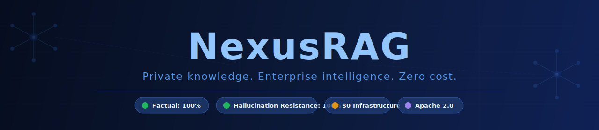
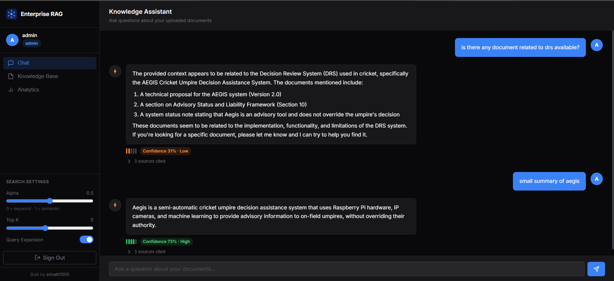
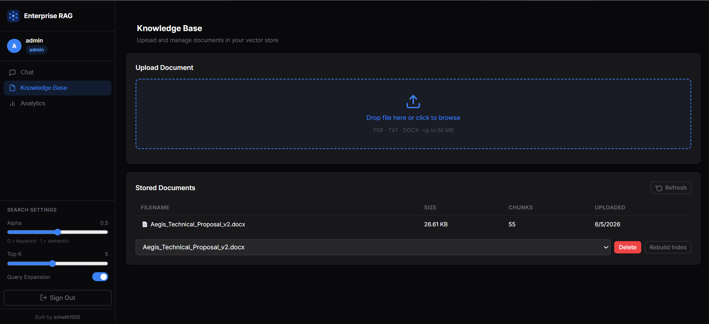
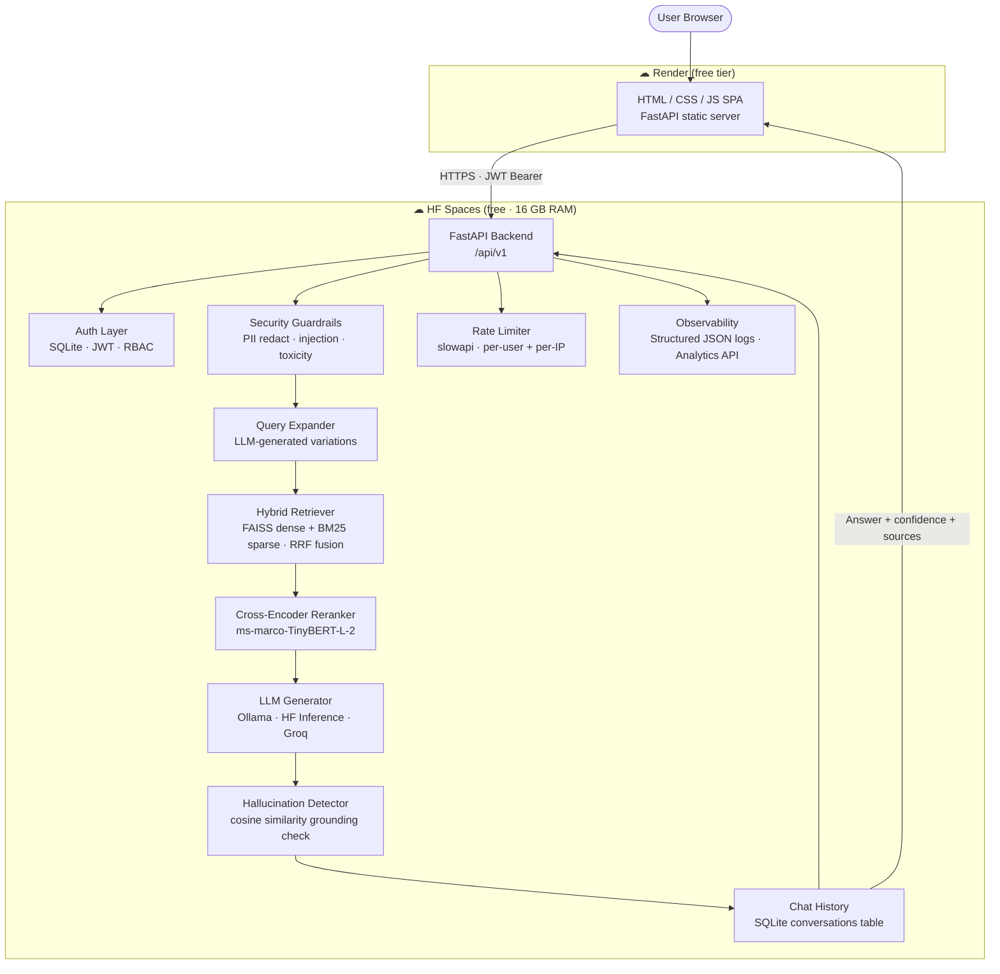

<div align="center">



<br/>

[](LICENSE)
[](https://www.python.org/)
[](https://fastapi.tiangolo.com/)
[](frontend/static/)
[](test_report.md)
[](benchmark_results_final.json)
[](benchmark_results_final.json)
[-FFD21E?logo=huggingface&logoColor=000)](https://huggingface.co/spaces/Srinath-54/rag-backend)

<br/>

**NexusRAG is a production-ready, self-hosted Retrieval-Augmented Generation platform  
that runs on a moderate laptop or free cloud tier — no cloud budget required.**

It delivers the retrieval accuracy, security posture, and observability expected of an  
enterprise system while remaining fully free, fully private, and fully yours.

<br/>

[](https://rag-frontend-txy6.onrender.com/)

**Default credentials &nbsp;|&nbsp; Username:** `admin` &nbsp;&nbsp; **Password:** `1234567890qwerty`

> The demo runs on Render free tier — allow ~30 s for a cold start on first visit.

</div>

---

## Table of Contents

- [Overview](#overview)
- [UI Preview](#ui-preview)
- [Architecture](#architecture)
- [Benchmark Results](#benchmark-results)
- [Features](#features)
- [Tech Stack](#tech-stack)
- [Cost Comparison](#cost-comparison)
- [Quick Start](#quick-start)
  - [Option A — Live Demo](#option-a--live-demo-no-setup)
  - [Option B — Docker Compose](#option-b--docker-compose-recommended-for-local)
  - [Option C — Local Development](#option-c--local-development)
- [LLM Configuration](#llm-configuration)
- [Supported Document Types](#supported-document-types)
- [Environment Variables](#environment-variables)
- [API Reference](#api-reference)
- [QA & Testing](#qa--testing)
- [Roadmap](#roadmap)
- [Contributing & Attribution](#contributing--attribution)
- [License](#license)
- [Built By](#built-by)

---

## Overview

Most "enterprise RAG" solutions assume you have a Pinecone subscription, an OpenAI bill,
and a Kubernetes cluster. NexusRAG assumes none of that.

It is a complete, production-hardened RAG stack — hybrid retrieval, reranking,
hallucination detection, JWT auth, RBAC, rate limiting, structured logging, and a clean
SPA frontend — that runs on a single machine with 4 GB of RAM and an internet connection,
or entirely offline with a local LLM.

**The core design principles:**

| Principle | What it means in practice |
|-----------|--------------------------|
| **Zero lock-in** | Swap LLM, embeddings, or vector store by editing `.env` — nothing is hardcoded |
| **Free by default** | Every default component has a free-tier or local option |
| **Private by default** | Documents never leave your machine unless you explicitly choose a cloud LLM |
| **Production-grade** | Auth, RBAC, guardrails, rate limiting, observability — not bolted on, built in |
| **Moderate hardware** | Runs on any machine with 4 GB RAM; no GPU required |

---

## UI Preview

> Screenshots below are from the live deployment at [rag-frontend-txy6.onrender.com](https://rag-frontend-txy6.onrender.com/).

| Chat Interface | Admin — Knowledge Base |
|:-:|:-:|
|  |  |

| Admin — Analytics Dashboard | Upload & Ingest |
|:-:|:-:|
|  |  |

> **To add screenshots:** Log in to the live demo or your local instance, take a screenshot of each panel, and save them to `docs/screenshots/` using the filenames above.

---

## Architecture



**Deployment topology:**
- **Frontend** — Vanilla JS SPA served by a FastAPI static file server, hosted on Render free tier
- **Backend** — Full ML stack (PyTorch, sentence-transformers, FAISS) on HF Spaces (free, 16 GB RAM)
- **Local** — Both services run on `localhost` via Docker Compose or two terminals

---

## Benchmark Results

NexusRAG has been evaluated across two independent benchmark suites.

### Suite 1 — 150-Question Custom Benchmark

**150 questions across 3 difficulty tiers** — factual, reasoning, and adversarial — evaluated
against real documentation (LangChain docs + PostgreSQL 16 official PDF).
Judged by `llama-3.3-70b-versatile` via Groq. Full results in [`benchmark_results_final.json`](benchmark_results_final.json).

| Metric | LangChain | PostgreSQL | Overall |
|--------|:---------:|:----------:|:-------:|
| **Factual Accuracy** | 100% (25/25) | 100% (25/25) | **100%** |
| **Reasoning Score** | 4.0% (0.12/3) | 17.3% (0.52/3) | **10.7% normalised** |
| **Hallucination Resistance** | 100% — 0 hallucinations | 100% — 0 hallucinations | **100%** |

**What each tier measures:**

| Tier | Description | N |
|------|-------------|---|
| **Factual** | Specific facts retrievable directly from documents | 50 |
| **Reasoning** | Multi-concept questions requiring synthesis across chunks | 50 |
| **Adversarial** | Deliberately tricky questions designed to induce hallucination | 50 |

> **On the reasoning score:** Reasoning questions require multi-hop synthesis — explaining
> trade-offs between mechanisms, deriving behavioural implications, or comparing subsystem
> designs — where the answer is distributed across multiple non-contiguous passages rather
> than stated in a single chunk. Dense retrieval with top-3 reranking is highly precise at
> locating individual facts (100% factual accuracy) but does not reassemble explanations
> scattered across unrelated chunks. The 10.7% score is the expected outcome of this
> architectural characteristic. Improving it would require iterative retrieval (HyDE, RAG-Fusion),
> larger reranking windows, or a more capable generator model — none of which are
> free-tier constraints but deliberate scope decisions for this project's target hardware.

> **On hallucination resistance:** No standard RAGAS metric captures this. It specifically
> measures whether the system fabricates an answer when the retrieved context does not
> support one. NexusRAG returned zero hallucinations across all 50 adversarial questions —
> correctly answering when the information was present (3 questions) and explicitly
> declining when it was not (47 questions).

#### Reproduce this benchmark end-to-end

**Prerequisites**
- Python 3.10+
- Git
- A free Groq API key — [console.groq.com/keys](https://console.groq.com/keys) (used for both RAG generation and LLM-as-judge evaluation)
- ~3 GB free disk space (benchmark vector store + docs)
- ~2–4 GB RAM (sentence-transformers + FAISS run on CPU)

```bash
# 1. Clone the repository and install dependencies
git clone https://github.com/srinath1505/free_tier-enterprise_grade-rag.git
cd free_tier-enterprise_grade-rag
pip install -r requirements.txt

# 2. Configure your Groq API key
cp .env.example .env
# Open .env and set:
#   LLM_PROVIDER=groq
#   GROQ_API_KEY=gsk_your_key_here
#   GROQ_MODEL=llama-3.1-8b-instant

# 3. Download LangChain documentation
git clone --depth 1 https://github.com/langchain-ai/docs.git /tmp/langchain-docs
python - << 'EOF'
import pathlib, shutil
src = pathlib.Path("/tmp/langchain-docs/src/oss")
dst = pathlib.Path("benchmark_docs/langchain")
dst.mkdir(parents=True, exist_ok=True)
for f in src.rglob("*.md*"):
    words = len(f.read_text(encoding="utf-8", errors="ignore").split())
    if words >= 200:          # skip index / navigation stubs
        rel = f.relative_to(src)
        (dst / rel).parent.mkdir(parents=True, exist_ok=True)
        shutil.copy(f, dst / rel)
EOF

# 4. Download PostgreSQL 16 documentation PDF (~14.5 MB)
mkdir -p benchmark_docs/postgresql
curl -L https://www.postgresql.org/files/documentation/pdf/16/postgresql-16-A4.pdf \
     -o benchmark_docs/postgresql/postgresql-16-docs.pdf

# 5. Run the full benchmark
#    First run ingests 36,564 chunks into benchmark_vector_store/ (~15 min on CPU)
#    Subsequent runs use --skip-ingest to reuse it
python benchmark_runner.py

# 6. Subsequent runs — skip the ingest entirely
python benchmark_runner.py --skip-ingest

# 7. If you hit Groq rate limits mid-run, resume from where it stopped
python benchmark_runner.py --skip-ingest --from-id 91 --delay 4

# 8. Merge partial runs into one final result file
python merge_benchmark_results.py \
    benchmark_results_<run1_timestamp>.json \
    benchmark_results_<run2_timestamp>.json \
    --splits 91 \
    --out benchmark_results_final.json
```

> **Rate limit tip:** The Groq free tier allows ~30 requests/min per model. Using
> `--delay 3` keeps throughput safely under the limit. The `--from-id N` flag
> resumes from any question ID so no work is lost on an interrupted run.

---

### Suite 2 — RAGAS Controlled Evaluation

**Evaluator LLM:** `llama-3.1-8b-instant` (Groq) · **Embedding:** `all-MiniLM-L6-v2`

> **Scope:** 25 Q&A pairs over 3 purpose-built documents. Measures pipeline correctness
> under clean, structured input.

| Metric | Score | What it measures |
|--------|:-----:|-----------------|
| **Faithfulness** | **0.92 / 1.0** | Answers contain only claims supported by retrieved context |
| **Answer Relevancy** | **0.85 / 1.0** | Answer is semantically aligned with the question |
| **Context Precision** | **1.00 / 1.0** | Every retrieved chunk is relevant |
| **Context Recall** | **1.00 / 1.0** | All information needed to answer was retrieved |
| **Average** | **0.94 / 1.0** | |

```bash
pip install ragas>=0.2.0 langchain-groq>=0.1.0
python backend/scripts/ragas_benchmark.py --ingest
```

Full scores: [`ragas_final_scores.json`](ragas_final_scores.json)

---

## Features

### Retrieval Engine
- **Hybrid search** — FAISS dense vectors + BM25 sparse, fused with Weighted Reciprocal Rank Fusion
- **Multi-query expansion** — LLM generates query variations to widen recall before retrieval
- **Cross-encoder reranking** — `ms-marco-TinyBERT-L-2` re-scores top candidates for precision
- **Hallucination grounding check** — cosine similarity between answer and retrieved context; flags or warns when below threshold
- **Confidence scoring** — 0–100 score combining reranker logit, grounding score, and source count

### Document Processing
- **PDF** — pdfplumber text + table extraction (as markdown); image captioning via Groq vision (opt-in)
- **DOCX** — paragraph + table extraction in document order; embedded image captioning (opt-in)
- **TXT / MD / MDX** — plain text, preserving structure
- **Semantic chunking** — spaCy sentence segmentation with configurable chunk size and overlap

### Security
- **JWT authentication** — `HS256` tokens, configurable expiry
- **RBAC** — `admin` (upload/manage KB, view analytics) and `viewer` (query only) roles
- **Input validation** — username format, password complexity enforced at registration
- **Security guardrails** — prompt injection, jailbreak patterns, toxic keywords, PII redaction
- **File upload validation** — type allowlist (PDF/DOCX/TXT), 50 MB cap, path-traversal sanitisation — all enforced before disk write
- **Rate limiting** — configurable per-IP (auth) and per-user (query/upload) via `slowapi`

### Observability & Ops
- **Structured JSON logs** — stdout by default; `LOG_FILE_DIR` enables rotating file logs
- **Analytics API** — admin endpoint exposing query counts, latency distribution, top queries
- **Health endpoint** — `GET /health` for Docker / load-balancer probes
- **Persistent chat history** — `conversations` table in SQLite, keyed by username
- **Docker Compose** — backend + frontend + named volumes in one command
- **Zero hardcoded values** — every model, URL, limit, and key is overridable via `.env`

---

## Tech Stack

| Layer | Technology | Notes |
|-------|-----------|-------|
| **Backend** | FastAPI + Pydantic v2 | Async, automatic OpenAPI docs at `/api/v1/openapi.json` |
| **Frontend** | Vanilla JS SPA + Inter font | No framework dependency — served by FastAPI static server |
| **Auth** | JWT (python-jose) + SQLite (aiosqlite) | Zero infra cost, industry-standard tokens |
| **Vector search** | FAISS `IndexFlatIP` | GPU-optional, L2-normalised cosine similarity |
| **Keyword search** | BM25 (rank-bm25) | Sparse signal, no index server needed |
| **Fusion** | Weighted RRF | Configurable `alpha` blending dense vs. sparse |
| **Reranker** | `ms-marco-TinyBERT-L-2-v2` (CrossEncoder) | CPU-friendly, high-precision re-scoring |
| **Embeddings** | `all-MiniLM-L6-v2` (sentence-transformers) | 384-dim, fast on CPU |
| **LLM** | Ollama · HF Inference API · Groq | Swappable via `LLM_PROVIDER` in `.env` |
| **PDF parsing** | pdfplumber | Accurate text + table extraction |
| **DOCX parsing** | python-docx | Paragraph + table + embedded image support |
| **NLP chunking** | spaCy `en_core_web_sm` | Sentence-boundary chunking |
| **Rate limiting** | slowapi | Per-user + per-IP, configurable via env |
| **Containers** | Docker + Docker Compose | Named volumes for FAISS index and SQLite DB |
| **Security** | custom guardrail pipeline | PII redact, injection detection, toxicity filter |

---

## Cost Comparison

| Component | Typical Commercial | NexusRAG |
|-----------|-------------------|---------|
| Vector DB | Pinecone Starter ~$70/mo | FAISS — local, free |
| LLM API | OpenAI GPT-4 ~$100–400/mo | Ollama (local) or HF / Groq free tier |
| Cloud infra | AWS / GCP ~$50–100/mo | HF Spaces + Render free tier / local |
| Auth / DB | Auth0 ~$23/mo + RDS ~$15/mo | SQLite + JWT — built-in |
| Reranker | Cohere Rerank ~$1/1K calls | ms-marco-TinyBERT — local, free |
| **Total** | **~$260–610/mo** | **$0** |

---

## Quick Start

### Option A — Live Demo (no setup)

[](https://rag-frontend-txy6.onrender.com/)

| Field | Value |
|-------|-------|
| Username | `admin` |
| Password | `1234567890qwerty` |

> The demo runs on Render + HF Spaces free tier. Expect a ~30 s cold start if either
> service has been idle. All data resets on redeploy — treat it as a playground.

---

### Option B — Docker Compose (recommended for local)

**Prerequisites:** Docker Desktop installed and running.

```bash
git clone https://github.com/srinath1505/free_tier-enterprise_grade-rag.git
cd free_tier-enterprise_grade-rag

cp .env.example .env
# Open .env and set at minimum:
#   SECRET_KEY   — any long random string
#   LLM_PROVIDER — local | hf | groq  (see LLM Configuration below)

docker compose up --build
```

| Service | URL |
|---------|-----|
| Frontend | http://localhost:8080 |
| Backend API | http://localhost:8000 |
| Interactive API docs | http://localhost:8000/api/v1/openapi.json |

To ingest your own documents, log in as admin and use the **Upload** panel in the UI,
or call `POST /api/v1/ingest/upload` directly.

---

### Option C — Local Development

```bash
git clone https://github.com/srinath1505/free_tier-enterprise_grade-rag.git
cd free_tier-enterprise_grade-rag

python -m venv venv
.\venv\Scripts\Activate   # Windows PowerShell
source venv/bin/activate  # Linux / macOS

pip install -r requirements.txt
pip install -r requirements-frontend.txt

cp .env.example .env
# Edit .env as needed
```

**Terminal 1 — Backend**
```bash
uvicorn backend.main:app --reload --port 8000
```

**Terminal 2 — Frontend**
```bash
uvicorn frontend.server:app --reload --port 8080
```

Open http://localhost:8080 in your browser.

---

#### Deploy your own cloud instance (HF Spaces + Render)

The ML backend (PyTorch + sentence-transformers + FAISS) requires ~700 MB RAM — more than
most free containers except **Hugging Face Spaces** (free, 16 GB). The frontend is
lightweight and runs comfortably on **Render free tier** (512 MB).

**Step 1 — Deploy backend to HF Spaces (~5 min)**

1. Create a new Space at [huggingface.co/new-space](https://huggingface.co/new-space):
   SDK → **Docker** · Visibility → **Public**
2. Add a repository secret at **Settings → Secrets → Actions**:

   | Secret | Value |
   |--------|-------|
   | `HF_TOKEN` | HF token with **write** access — [huggingface.co/settings/tokens](https://huggingface.co/settings/tokens) |

3. Push any commit to `main` — the **Deploy Backend to HF Spaces** GitHub Action pushes
   the backend automatically.
4. Wait ~10 min for the first build. Your backend URL:
   `https://<your-username>-rag-backend.hf.space`

> **Free-tier note:** Spaces sleep after ~30 min of inactivity (30 s cold start on next
> request). Enable **Pinned** in Space settings to keep it always-on (free for public
> Spaces).

**Step 2 — Deploy frontend to Render (~2 min)**

[](https://render.com/deploy?repo=https://github.com/srinath1505/free_tier-enterprise_grade-rag)

When prompted set `BACKEND_URL` to your HF Spaces URL from Step 1.

---

## LLM Configuration

NexusRAG supports three LLM providers switchable via a single env var. Nothing in the
application code changes — set `LLM_PROVIDER` in `.env` and restart.

### Ollama — local, fully offline (default)

```ini
LLM_PROVIDER=local
OLLAMA_BASE_URL=http://localhost:11434
OLLAMA_MODEL=phi3:mini
```

Install Ollama from [ollama.com](https://ollama.com), then pull a model:

```bash
ollama pull phi3:mini        # ~2 GB, fast on CPU
ollama pull mistral          # ~4 GB, better quality
ollama pull llama3.2:3b      # ~2 GB, good balance
```

Inside Docker on **Mac / Windows** use `http://host.docker.internal:11434`.
On **Linux** replace with your host IP or run Ollama as a separate Compose service.

---

### Hugging Face Inference API — free cloud tier

```ini
LLM_PROVIDER=hf
HF_TOKEN=hf_your_token_here
HF_INFERENCE_API_URL=mistralai/Mistral-7B-Instruct-v0.2
```

Get a free token at [huggingface.co/settings/tokens](https://huggingface.co/settings/tokens).
Free tier includes generous request quotas. No credit card required.

---

### Groq — advanced / high-throughput option

```ini
LLM_PROVIDER=groq
GROQ_API_KEY=gsk_your_key_here
GROQ_MODEL=llama-3.1-8b-instant
```

Get a free API key at [console.groq.com/keys](https://console.groq.com/keys).
Groq's free tier offers high token throughput with very low latency — recommended when
running the benchmark suite or building integrations that need consistent response times.

Suggested models:

| Model | Speed | Quality | Use case |
|-------|-------|---------|----------|
| `llama-3.1-8b-instant` | Very fast | Good | Development, high-volume |
| `llama-3.3-70b-versatile` | Moderate | Excellent | Evaluation, production queries |
| `gemma2-9b-it` | Fast | Good | Balanced default |

---

## Supported Document Types

| Format | Text | Tables | Images | Notes |
|--------|:----:|:------:|:------:|-------|
| **PDF** | ✅ | ✅ markdown | ✅ captioned* | pdfplumber; table regions excluded from plain text pass |
| **DOCX** | ✅ | ✅ markdown | ✅ captioned* | python-docx; preserves paragraph + table order |
| **TXT / MD / MDX** | ✅ | — | — | UTF-8, loaded as plain text |

*Image captioning is **opt-in**. Set `GROQ_API_KEY` in `.env` to enable it at ingest time.
If the key is absent, images are silently skipped — the rest of the document ingests
normally with no errors.

---

## Environment Variables

Copy `.env.example` to `.env` and edit before first run. All variables have safe defaults
for local development; the ones marked **must change** should be updated before any
internet-facing deployment.

```bash
cp .env.example .env
```

| Variable | Default | Required | Description |
|----------|---------|:--------:|-------------|
| `SECRET_KEY` | placeholder | **Must change** | JWT signing key — generate with `python -c "import secrets; print(secrets.token_hex(32))"` |
| `ADMIN_DEFAULT_PASSWORD` | `password` | **Must change** | Admin account seed password |
| `DATABASE_URL` | `sqlite+aiosqlite:///./users.db` | — | Overridden to a named volume path in Docker Compose |
| `LLM_PROVIDER` | `local` | — | `local` (Ollama) · `hf` (HF Inference) · `groq` |
| `OLLAMA_BASE_URL` | `http://localhost:11434` | if `local` | Use `http://host.docker.internal:11434` inside Docker on Mac/Windows |
| `OLLAMA_MODEL` | `phi3:mini` | if `local` | Any model pulled via `ollama pull` |
| `HF_TOKEN` | _(empty)_ | if `hf` | HF token with inference permissions |
| `HF_INFERENCE_API_URL` | `mistralai/Mistral-7B-Instruct-v0.2` | if `hf` | Any HF model ID supporting chat completion |
| `GROQ_API_KEY` | _(empty)_ | if `groq` | Groq API key — also enables PDF/DOCX image captioning at ingest |
| `GROQ_MODEL` | `gemma2-9b-it` | if `groq` | Any model available on the Groq platform |
| `EMBEDDING_MODEL_NAME` | `sentence-transformers/all-MiniLM-L6-v2` | — | Any sentence-transformers compatible model |
| `RERANKER_MODEL_NAME` | `cross-encoder/ms-marco-TinyBERT-L-2-v2` | — | Any CrossEncoder compatible model |
| `MAX_UPLOAD_SIZE_MB` | `50` | — | File upload size cap in megabytes |
| `RATE_LIMIT_AUTH_PER_MIN` | `20` | — | Requests/min per IP for `/token` and `/register` |
| `RATE_LIMIT_QUERY_PER_MIN` | `20` | — | Requests/min per user for `/rag/query` |
| `RATE_LIMIT_UPLOAD_PER_MIN` | `10` | — | Requests/min per user for `/ingest/upload` |
| `LOG_FILE_DIR` | _(empty)_ | — | Directory for rotating file logs; leave empty for stdout only |
| `LANGCHAIN_TRACING_V2` | `false` | — | Set `true` + `LANGCHAIN_API_KEY` to enable LangSmith tracing |

---

## API Reference

All endpoints are prefixed with `/api/v1`. Interactive docs at
`http://localhost:8000/api/v1/openapi.json`.

### Auth

| Method | Endpoint | Auth | Description |
|--------|----------|:----:|-------------|
| `POST` | `/token` | — | Login with username + password → JWT |
| `POST` | `/register` | — | Register new account → JWT (viewer role) |
| `GET` | `/me` | JWT | Returns `{username, role}` for the current token |

### RAG

| Method | Endpoint | Auth | Description |
|--------|----------|:----:|-------------|
| `POST` | `/rag/query` | JWT | Hybrid retrieve → rerank → LLM → grounded answer |

Request body:
```json
{
  "query": "string",
  "top_k": 5,
  "alpha": 0.5,
  "use_query_expansion": true
}
```

Response:
```json
{
  "answer": "string",
  "sources": [...],
  "confidence": 87,
  "warning": null
}
```

### Knowledge Base (admin only)

| Method | Endpoint | Auth | Description |
|--------|----------|:----:|-------------|
| `POST` | `/ingest/upload` | Admin JWT | Upload PDF / DOCX / TXT → chunk → embed → index |
| `GET` | `/ingest/files` | Admin JWT | List indexed files with chunk counts |
| `DELETE` | `/ingest/files/{filename}` | Admin JWT | Remove a file from the knowledge base |
| `POST` | `/ingest/rebuild` | Admin JWT | Wipe and re-ingest all files from scratch |

### History & Analytics

| Method | Endpoint | Auth | Description |
|--------|----------|:----:|-------------|
| `GET` | `/history/{session_id}` | JWT | Retrieve chat history for a session (own session only) |
| `GET` | `/analytics` | Admin JWT | Query counts, latency distribution, top queries |

### System

| Method | Endpoint | Auth | Description |
|--------|----------|:----:|-------------|
| `GET` | `/health` | — | `{"status": "ok"}` — Docker / load-balancer probe |
| `GET` | `/` | — | Welcome message |

---

## QA & Testing

NexusRAG ships with a comprehensive smoke test covering auth, RBAC, upload, query,
hallucination detection, rate limiting, history, and security guardrails.

```bash
# Terminal 1 — start the backend
uvicorn backend.main:app --host 0.0.0.0 --port 8000

# Terminal 2 — run the full suite
python smoke_test.py
```

**Last result: 71 / 71 assertions — 100% pass rate.**

Full test report: [`test_report.md`](test_report.md)

---

## Roadmap

| Feature | Status |
|---------|--------|
| SQLite user store + JWT auth | ✅ Done |
| Persistent chat history | ✅ Done |
| Docker Compose (backend + frontend) | ✅ Done |
| Rate limiting | ✅ Done |
| Input validation + security guardrails | ✅ Done |
| One-click Render + HF Spaces deploy | ✅ Done |
| RAGAS evaluation framework | ✅ Done |
| HTML / CSS / JS SPA frontend | ✅ Done |
| PDF table + image extraction | ✅ Done |
| DOCX table + image extraction | ✅ Done |
| 150-question LLM-as-judge benchmark | ✅ Done |
| Hallucination resistance metric | ✅ Done |
| Multi-tenancy (per-user document isolation) | 🔄 Planned |
| Streaming responses | 🔄 Planned |
| Demo GIF / video walkthrough | 🔄 Planned |

---

## Contributing & Attribution

NexusRAG is open source under the Apache 2.0 License. Contributions are welcome via pull
request.

**Attribution requirement:** If you use NexusRAG — whether in a personal project, a
commercial product, or a deployed service — please include a visible credit:

```
Powered by NexusRAG — created by Srinath Selvakumar
https://github.com/srinath1505/free_tier-enterprise_grade-rag
```

This is not a legal obligation under Apache 2.0 for internal use, but it is a reasonable
ask. If you build something public or commercial on top of NexusRAG, a mention keeps the
project alive and lets others discover it.

---

## License

```
Copyright 2024 Srinath Selvakumar

Licensed under the Apache License, Version 2.0 (the "License");
you may not use this file except in compliance with the License.
You may obtain a copy of the License at

    http://www.apache.org/licenses/LICENSE-2.0

Unless required by applicable law or agreed to in writing, software
distributed under the License is distributed on an "AS IS" BASIS,
WITHOUT WARRANTIES OR CONDITIONS OF ANY KIND, either express or implied.
See the License for the specific language governing permissions and
limitations under the License.
```

---

## Built By

**Srinath Selvakumar** — building accessible, production-grade AI tools.

[](https://github.com/srinath1505)
